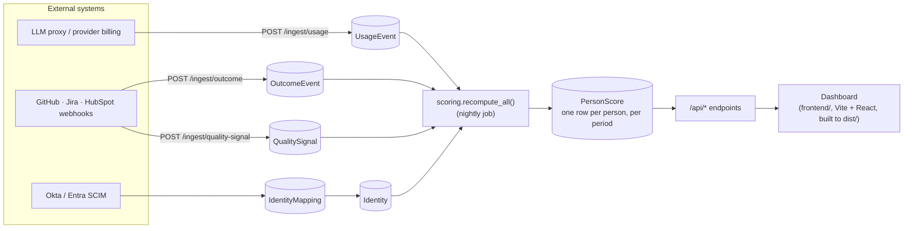
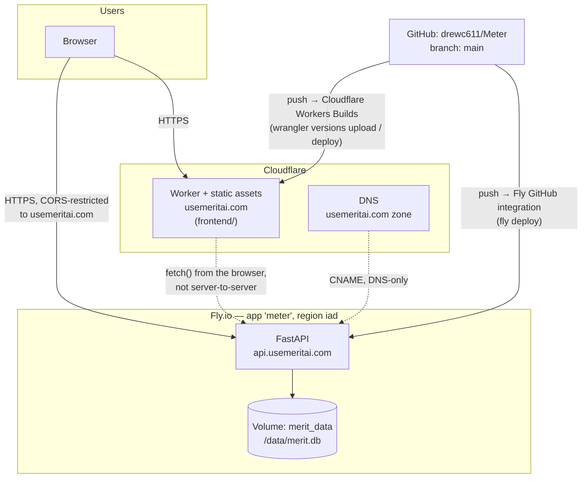

# Architecture

Two diagrams, then a plain-language verdict on whether the way this is
actually hosted makes sense. This file documents reality as it's deployed
today, not an aspirational future state — see [DEPLOY.md](DEPLOY.md) for the
runbook that produced it.

## 1. System architecture (what the code does)

Three independent ingestion paths write into three separate tables, all
attributed to a person through an identity-mapping table, and a nightly job
compresses everything into one scored row per person that the API/UI reads.
This is the same shape documented in [`CLAUDE.md`](CLAUDE.md) and
[`backend/README.md`](backend/README.md); the diagram below is the same
picture, rendered.

**The load-bearing invariant:** the dashboard and every `/api/*` endpoint
read only `PersonScore`, never raw events — page loads stay fast regardless
of how much event history accumulates. `IdentityMapping` is the other
load-bearing piece: if an external id resolves to the wrong (or no) person,
every number downstream is wrong, which is why unmapped ids 422 instead of
silently dropping.

## 2. Deployment architecture (where the code runs)

Two independent deploy paths, both triggered by a push to `main` in this one
repo — no second repo, no manual deploy step in the common case. Non-`main`
branches get Cloudflare preview URLs automatically (see the bot comment on
any PR); Fly has no equivalent preview environment yet (see below).

## 3. Does this hosting choice make sense?

**Yes, for what this actually is right now** — an early-stage prototype
being demoed to prospects, not yet handling real customer data. The backend
and frontend have genuinely different shapes, and the split matches that:

- **The frontend builds to static assets** (`frontend/` is a Vite + React
  app — see `CLAUDE.md` — but `npm run build` produces a plain `dist/` of
  HTML/JS/CSS with no server-side rendering), so a CDN-native static host
  is still the right tool. Cloudflare Workers with static assets gives that
  for free: global distribution, automatic HTTPS, zero servers to run, and
  per-PR preview URLs with no extra config — the build step just runs as
  part of that pipeline (see `DEPLOY.md`) rather than at request time.
- **The backend is stateful** (SQLite file, in-process scoring job) and
  needs a place that keeps a process and a disk alive continuously — Fly.io
  is a reasonable, low-overhead choice for that at this scale, and
  `fly.toml`'s `min_machines_running = 1` correctly avoids the volume
  attach/detach churn that scale-to-zero would cause for a single-SQLite-file
  app.
- **CORS is locked down** to the real production origins
  (`MERIT_CORS_ORIGINS` in `fly.toml`), not left wide open the way the local
  dev default is — the one thing that would have made this an easy first
  mistake, done correctly.

**Not yet for handling real customer data.** Real per-user login and
`/admin/*` role checks are in (see `SECURITY.md`), but standard
pre-production hardening still needs to land: rate limiting, an audit log,
backup coverage on the database volume, a staging environment, and
monitoring/alerting. None of that is a reason to change the underlying
split (Fly + Cloudflare Workers); it's ordinary engineering work on top
of it.
