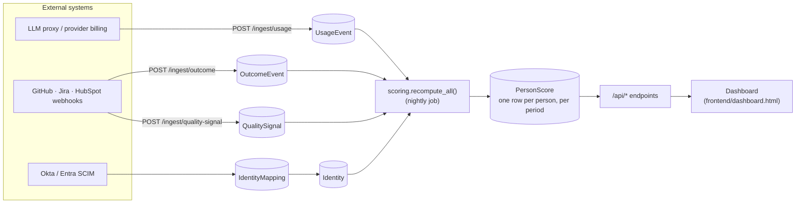
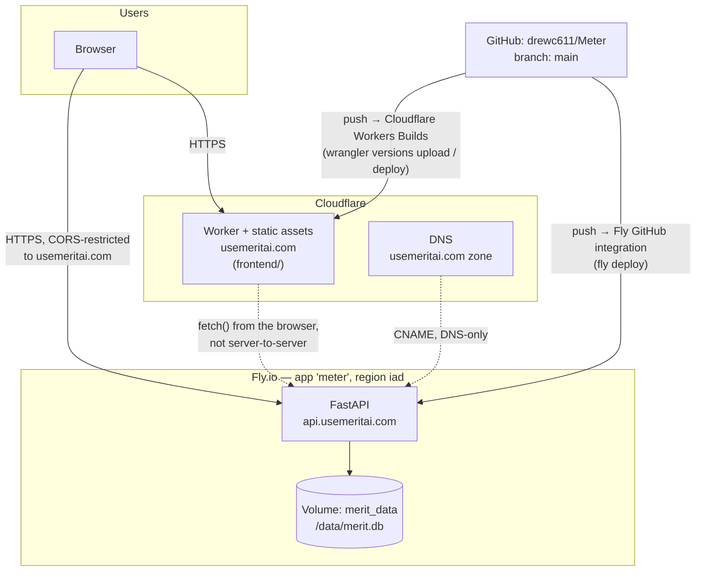

# Architecture

Two diagrams, then a plain-language verdict on whether the way this is
actually hosted makes sense. This file documents reality as it's deployed
today, not an aspirational future state — see [DEPLOY.md](DEPLOY.md) for the
runbook that produced it.

## 1. System architecture (what the code does)

Three independent ingestion paths write into three separate tables, all
attributed to a person through an identity-mapping table, and a nightly job
compresses everything into one scored row per person that the API/UI reads.
This is the same shape documented in [`CLAUDE.md`](CLAUDE.md) and
[`backend/README.md`](backend/README.md); the diagram below is the same
picture, rendered.

**The load-bearing invariant:** the dashboard and every `/api/*` endpoint
read only `PersonScore`, never raw events — page loads stay fast regardless
of how much event history accumulates. `IdentityMapping` is the other
load-bearing piece: if an external id resolves to the wrong (or no) person,
every number downstream is wrong, which is why unmapped ids 422 instead of
silently dropping.

## 2. Deployment architecture (where the code runs)

Two independent deploy paths, both triggered by a push to `main` in this one
repo — no second repo, no manual deploy step in the common case. Non-`main`
branches get Cloudflare preview URLs automatically (see the bot comment on
any PR); Fly has no equivalent preview environment (see gap list below).

## 3. Does this hosting choice make sense?

**Yes, for what this actually is right now** — an early-stage prototype
being demoed to prospects, not yet handling real customer data. The backend
and frontend have genuinely different shapes, and the split matches that:

- **The frontend is static** (`frontend/` has zero build step by design —
  see `CLAUDE.md`), so a CDN-native static host is the right tool.
  Cloudflare Workers with static assets gives that for free: global
  distribution, automatic HTTPS, zero servers to run, and per-PR preview
  URLs with no extra config.
- **The backend is stateful** (SQLite file, in-process scoring job) and
  needs a place that keeps a process and a disk alive continuously — Fly.io
  is a reasonable, low-overhead choice for that at this scale, and
  `fly.toml`'s `min_machines_running = 1` correctly avoids the volume
  attach/detach churn that scale-to-zero would cause for a single-SQLite-file
  app.
- **CORS is locked down** to the real production origins
  (`MERIT_CORS_ORIGINS` in `fly.toml`), not left wide open the way the local
  dev default is — the one thing that would have made this an easy first
  mistake, done correctly.

**No, not yet for handling real customer data.** The architecture is sound
for a demo; it is missing several things that are table stakes before this
should hold data for a paying customer. In priority order:

| # | Gap | Why it matters | What closing it looks like |
|---|---|---|---|
| 1 | **No authentication on any endpoint, by default** — `/api/*`, `/ingest/*`, `/admin/*` are all open to anyone with the URL unless `MERIT_API_KEY` is set. CORS only restricts browser-based reads; it does nothing against a direct `curl`. **Status: closeable, not yet closed.** The code exists (`app/dependencies.py:require_api_key`, a bearer-token gate wired onto all three routers) and is covered by tests, but it's inert until the Fly secret is actually set — see `DEPLOY.md`'s go-live checklist. It's also a single shared secret, not per-user accounts. | This is the actual reason the public site shows a "coming soon" placeholder instead of the real dashboard (see `DEPLOY.md`) — the data isn't safe to expose until the secret is set. | Complete `DEPLOY.md`'s go-live checklist to activate the shared-secret gate now; move to per-user SSO/OAuth before this needs to support more than a handful of trusted people who all share one token. |
| 2 | **Single SQLite file on a single volume, no backups.** One Fly machine, one disk. A lost/corrupted volume is a lost company's data with no recovery path. | SQLite has no built-in replication; Fly volumes aren't automatically snapshotted. | Either scheduled `fly volumes snapshots` (Fly supports this natively) as a stopgap, or migrate to a managed Postgres (Fly Postgres or an external provider) once there's more than one tenant's data to lose. |
| 3 | **No staging environment for the backend.** Every push to `main` deploys straight to the only Fly app. The frontend gets this for free via Cloudflare's per-branch previews; the backend doesn't. | A bad migration or a broken `seed.py` change hits production directly, with no earlier catch point beyond CI's unit tests. | A second, smaller Fly app (`meter-staging`) on the same `fly.toml` shape, deployed from a non-`main` branch, checked manually before promoting. |
| 4 | **No monitoring/alerting beyond Fly's built-in health check.** The `/healthz` check restarts a crashed machine but nothing pages a human, and there's no error tracking (a Sentry-style tool) or structured logging. | Silent failures — a broken ingestion endpoint, a nightly job that stops running — would only surface when someone happens to look. | Wire up basic uptime alerting on `/healthz` and error tracking in `app/main.py`'s exception handling before this is customer-facing. |
| 5 | **No rate limiting on ingestion endpoints.** Combined with gap #1, this means anyone who finds the URL can both read and write. | Low likelihood at zero public traffic today; becomes real the moment the domain is more discoverable. | Standard reverse-proxy or app-level rate limiting once auth (gap #1) is in place — rate limiting alone doesn't fix an open write endpoint. |
| 6 | `www.usemeritai.com` isn't wired up as a custom domain on the Worker yet (root domain works, `www` 502s). | Minor — anyone typing `www.` gets a broken page instead of a redirect. | Add it under the Worker's **Settings → Domains & Routes** (see `DEPLOY.md` step 2.5). |

None of this is a reason to change the underlying split (Fly + Cloudflare
Workers) — it's a reason to close gap #1 before gap #6 stops being the
biggest problem on this list. The order above is also the order to fix them
in: auth first, since gaps #2–#5 are all "how bad is it if something goes
wrong," and #1 is "anyone can make something go wrong on purpose."
