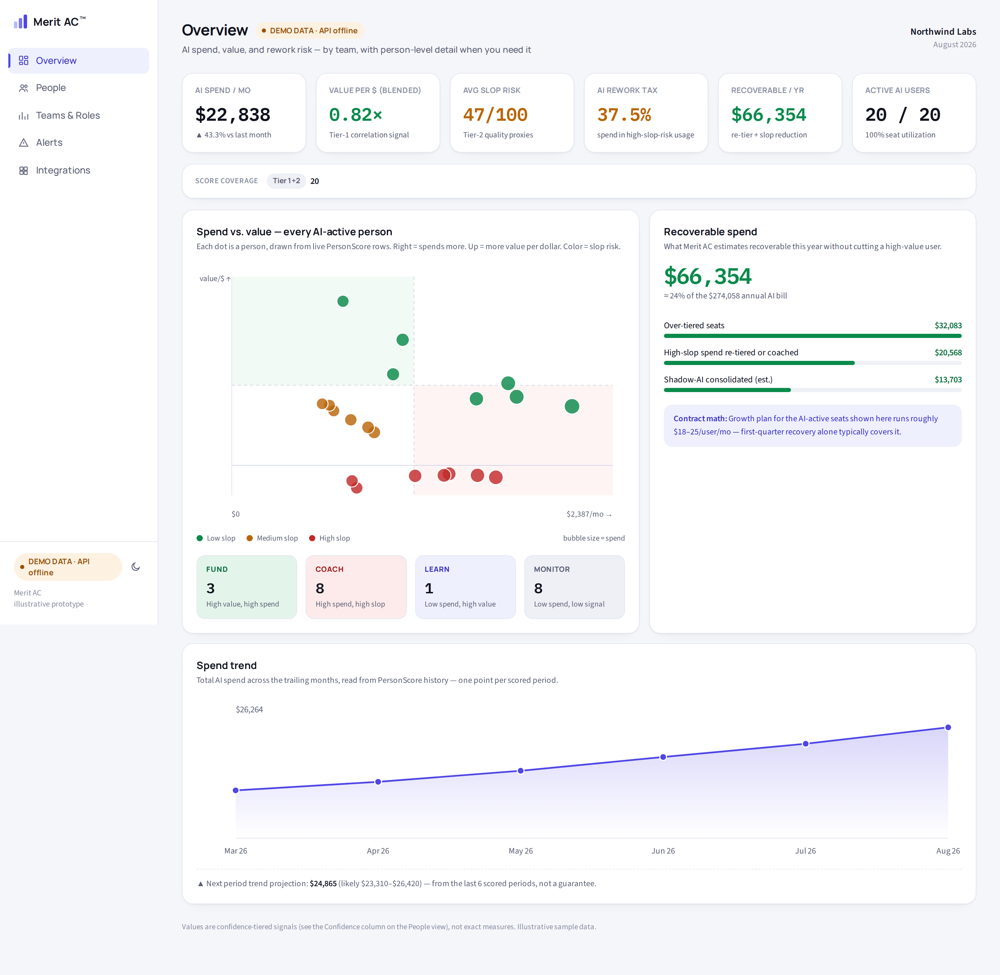
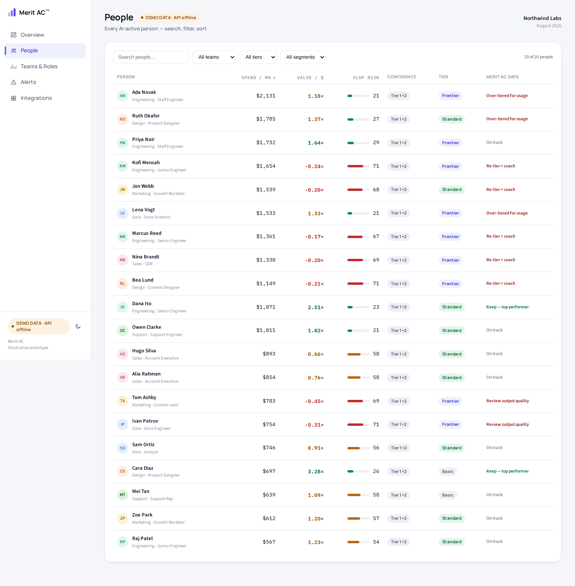
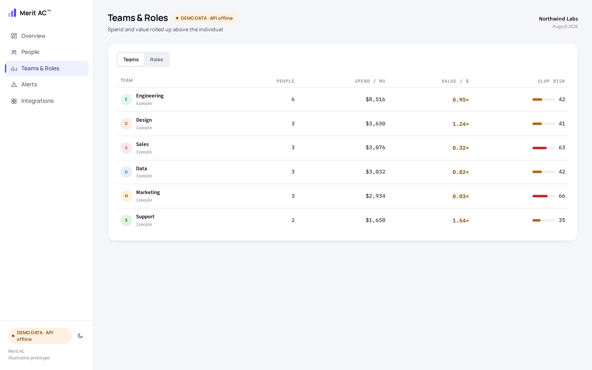
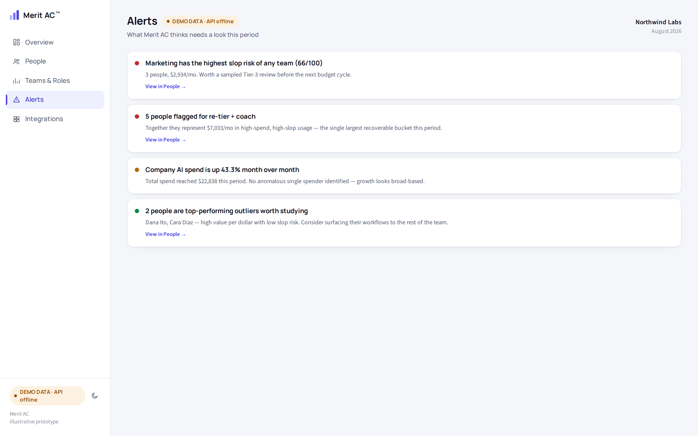
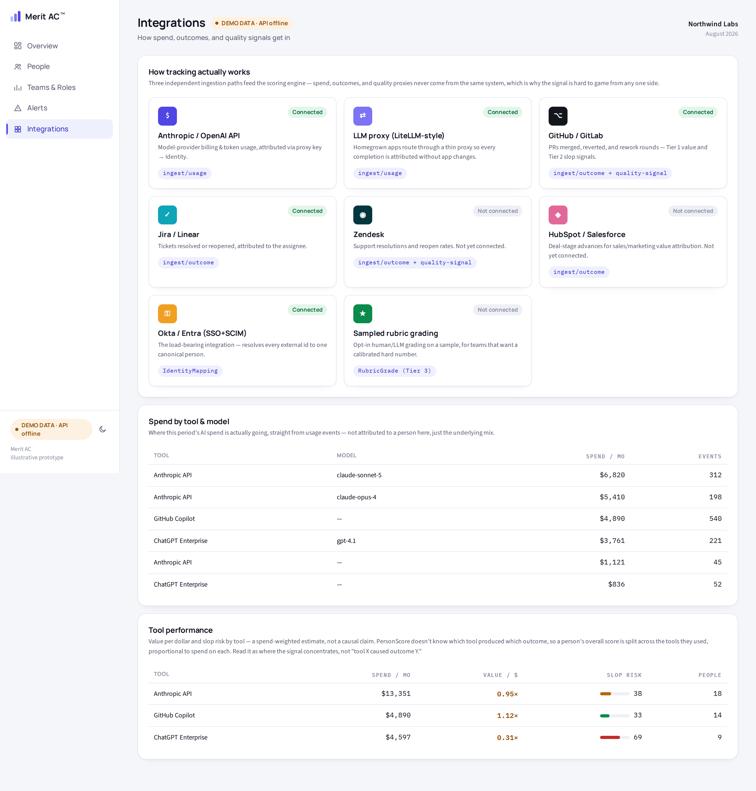
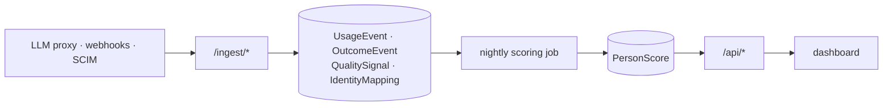

# Merit AC&trade;

A hub for AI — sourced news, a directory of models and tools, a glossary,
and a governed-agentic-DevSecOps content arm — anchored by a flagship
spend/value tracker built around the question spend-attribution tools
don't ask: is the work behind that spend any good? Merit AC attributes AI
spend to the person who generated it and correlates it against outcomes —
table stakes now — then layers a quality-risk score on top (reverts, heavy
rewrites, regeneration loops) so a clean "value per dollar" number can't
hide slop.

See [TRADEMARK.md](TRADEMARK.md) for the trademark notice and how the ™
mark is used across this repo.

**Status:** early prototype. `backend/` is a runnable FastAPI + SQLite
reference implementation of the tracking pipeline; `frontend/` is the
dashboard UI.

## What it looks like

Every screenshot below is the real dashboard, running against the live
backend on seeded demo data (`python seed.py`) — nothing mocked up, and it's
what's actually deployed at `/app` in production today (see
[Quickstart](#quickstart) and [DEPLOY.md](DEPLOY.md)). The site root itself
is a marketing/content landing page, not the dashboard — see
[Site content](#site-content) below.

**Overview** — spend, blended value/$, slop risk, seat utilization, and
score coverage at a glance, plus the spend-vs-value scatter, the four-segment
breakdown (fund / coach / learn / monitor), a recoverable-spend estimate, and
a multi-month spend trend.



**People** — every AI-active person, searchable/filterable/sortable by
spend, value/$, slop risk, confidence tier, and seat tier, each with Merit AC's
recommendation.



**Teams & Roles** — the same spend/value/slop signal rolled up above the
individual.



**Alerts** — what Merit AC thinks needs a look this period, each one linking
back into a pre-filtered People view.



**Integrations** — how spend, outcomes, and quality signals actually get in,
plus a live spend-by-tool-and-model breakdown.



## What's here

```
backend/       FastAPI service: usage/outcome/quality-signal ingestion,
               identity resolution, Tier-1/Tier-2 scoring, REST API.
               See backend/README.md for the full architecture writeup.
frontend/      Sidebar dashboard (Overview, People, Teams & Roles, Alerts,
               Integrations), a Vite + React app under src/ -- deployed at
               `/app` in production, not the site root. Calls the backend
               API at localhost:8000 and falls back to embedded demo data if
               it's not running. The site root and the rest of the content
               arm (architecture, setup guides, news, models, glossary,
               guides, prompts, challenge, community -- see "Site content"
               below) are separate prerendered pages, not part of the
               dashboard. See frontend/README.md.
               coming-soon.html is the old pre-launch placeholder, no longer
               served anywhere.
merit-ai-team/ Skills for the internal AI team that runs Merit AC's own
               product/growth/eng/infra loop -- not part of the shipped
               product. See merit-ai-team/skills/merit-context/SKILL.md.
```

## Site content

The site root (`/`) is a marketing/content landing page, not the dashboard
— it's a real React component (`frontend/src/content/pages/Home.jsx`) that
prerenders to plain static HTML at build time, same as the rest of the
content arm below, so it's a real crawlable file rather than a client-side
route (see `frontend/README.md`). The dashboard itself lives at `/app`,
linked from the "Sign in" button in the header.

- `/architecture` -- purely the system/deployment writeup from
  [`ARCHITECTURE.md`](ARCHITECTURE.md), reformatted for the public site: the
  ingestion/scoring pipeline, data model, where it runs, and what's
  deliberately not built yet
- `/setup/react`, `/setup/python`, `/setup/node`, `/setup/tensorflow-pyro` --
  how to wire your own AI usage into Merit AC's `/ingest/usage` endpoint
- `/news` -- sourced AI news commentary, the one arm that publishes
  autonomously with a Judge-tier fact-check pass as its review gate (see
  `merit-ai-team/skills/merit-growth/SKILL.md`)
- `/models` -- a directory of AI models and tools; every entry carries a
  source and a `verifiedDate`, spot-checked rather than trusted indefinitely
- `/glossary` -- plain-English AI term definitions
- `/guides`, `/prompts`, `/challenge` -- a governed-agentic-DevSecOps
  content arm adapted from an internal reference handbook: three long-form
  guides, a 30-day prompt archive, and a free capstone project (build a
  governed agentic delivery platform). `/guides` also carries a fourth,
  independent guide -- a general field guide to AI system design (twelve
  archetypes, six complex agent patterns, and the ML/AI software landscape),
  not adapted from the handbook and not specific to this product.
  `/prompts` links out to a separate composed-and-advanced prompt library
  (235 prompts across 41 categories, each naming which of the guide's
  patterns it combines) -- a different shape from the daily archive, so it
  lives at its own URL rather than inside the 30-day calendar.
- `/community` -- not open yet; an honest interest-list page rather than a
  placeholder for a platform or price that hasn't been decided

## Quickstart

```bash
cd backend
pip install -r requirements.txt
python seed.py                        # fabricates 6 months of sample activity, scores it
uvicorn app.main:app --reload --port 8000
```

Then, in a separate terminal:

```bash
cd frontend
npm install
npm run dev                           # http://localhost:5173
```

The sidebar badge shows whether it's reading from the live API or the
embedded fallback. See [`frontend/README.md`](frontend/README.md) for the
full frontend layout and commands.

Run the backend test suite with `make test` (or `pytest`) from `backend/`.

## Running with Docker

```bash
docker compose up --build
```

- **Frontend:** http://localhost:8080 (served by nginx — not `file://`, so it
  reaches the backend without the browser-security quirks of opening the file
  directly)
- **Backend API:** http://localhost:8000 — `curl http://localhost:8000/api/overview`

First boot seeds 6 months of sample data automatically (the backend container
runs `seed.py` once, only if its database volume is empty). The seeded data
lives in the `merit-db` named volume, so `docker compose down` and `up` again
picks up right where you left off; `docker compose down -v` wipes it for a
clean re-seed.

Two things to change before this ever points at real data: `MERIT_CORS_ORIGINS`
on the backend service (wide open by default — see `docker-compose.yml`) and
`MERIT_DATABASE_URL` if you're swapping SQLite for Postgres. See
[`backend/README.md`](backend/README.md) for the full config surface.

## Deploying

See [`DEPLOY.md`](DEPLOY.md) for the production setup this repo is actually
configured for: a Cloudflare Worker (static assets) for the frontend, Fly.io
for the backend.

## How it works

Three independent ingestion paths (spend, outcomes, quality signals) resolve
every event to a person through an identity-mapping table, then a nightly
job scores each person's spend against a value-per-dollar signal (Tier 1:
correlated against outcomes like PRs merged or tickets closed) and a slop
risk score (Tier 2: reverts, heavy rewrites, regeneration loops). See
[`backend/README.md`](backend/README.md) for the full data model, API
contract, and what's stubbed vs. implemented.

## Architecture



That's the code. For where it actually runs — Fly.io for the backend,
a Cloudflare Worker for the frontend, both deploying on push to `main` — plus
an honest verdict on whether that hosting choice makes sense and what's
missing before it's ready for real customer data, see
[`ARCHITECTURE.md`](ARCHITECTURE.md). Dashboard access is real per-user login
(password or Google) now, not a shared secret — known gaps still tracked in
[`SECURITY.md`](SECURITY.md).

## License

Dual-licensed — free for personal, non-commercial use (see
[`backend/personal.py`](backend/personal.py) for exactly that use case);
business/commercial use requires a separate license. Full terms in
[`LICENSE`](LICENSE).

## Branches

- `main` — stable
- `develop` — active development
