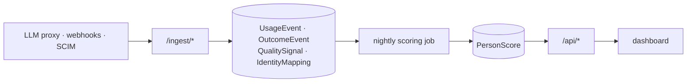

# Merit&trade;

AI spend tracker — tells a company what it spends on AI, who's spending it,
and whether that spend is producing real work or slop.

See [TRADEMARK.md](TRADEMARK.md) for the trademark notice and how the ™
mark is used across this repo.

**Status:** early prototype. `backend/` is a runnable FastAPI + SQLite
reference implementation of the tracking pipeline; `frontend/` is the
dashboard UI.

## What it looks like

Every screenshot below is the real dashboard, running against the live
backend on seeded demo data (`python seed.py`) — nothing mocked up. Note:
the public production site currently shows a "coming soon" placeholder
instead of this dashboard (see [Quickstart](#quickstart) and
[DEPLOY.md](DEPLOY.md)) — the dashboard itself is fully built and exactly
what's pictured here, just not what's deployed to visitors yet.

**Overview** — spend, blended value/$, slop risk, seat utilization, and
score coverage at a glance, plus the spend-vs-value scatter, the four-segment
breakdown (fund / coach / learn / monitor), a recoverable-spend estimate, and
a multi-month spend trend.


**People** — every AI-active person, searchable/filterable/sortable by
spend, value/$, slop risk, confidence tier, and seat tier, each with Merit's
recommendation.


**Teams & Roles** — the same spend/value/slop signal rolled up above the
individual.


**Alerts** — what Merit thinks needs a look this period, each one linking
back into a pre-filtered People view.


**Integrations** — how spend, outcomes, and quality signals actually get in,
plus a live spend-by-tool-and-model breakdown.


## What's here

```
backend/    FastAPI service: usage/outcome/quality-signal ingestion,
            identity resolution, Tier-1/Tier-2 scoring, REST API.
            See backend/README.md for the full architecture writeup.
frontend/   Sidebar dashboard (Overview, People, Teams & Roles, Alerts,
            Integrations) lives at dashboard.html + styles.css + app.js +
            fallback-data.js. Calls the backend API at localhost:8000 and
            falls back to embedded demo data if it's not running.
            index.html is a separate "coming soon" placeholder -- currently
            what's actually deployed to the public production site.
```

## Quickstart

```bash
cd backend
pip install -r requirements.txt
python seed.py                        # fabricates 6 months of sample activity, scores it
uvicorn app.main:app --reload --port 8000
```

Then open `frontend/dashboard.html` in a browser. The sidebar badge shows
whether it's reading from the live API or the embedded fallback.

Run the backend test suite with `make test` (or `pytest`) from `backend/`.

## Running with Docker

```bash
docker compose up --build
```

- **Frontend:** http://localhost:8080 (served by nginx — not `file://`, so it
  reaches the backend without the browser-security quirks of opening the file
  directly)
- **Backend API:** http://localhost:8000 — `curl http://localhost:8000/api/overview`

First boot seeds 6 months of sample data automatically (the backend container
runs `seed.py` once, only if its database volume is empty). The seeded data
lives in the `merit-db` named volume, so `docker compose down` and `up` again
picks up right where you left off; `docker compose down -v` wipes it for a
clean re-seed.

Two things to change before this ever points at real data: `MERIT_CORS_ORIGINS`
on the backend service (wide open by default — see `docker-compose.yml`) and
`MERIT_DATABASE_URL` if you're swapping SQLite for Postgres. See
[`backend/README.md`](backend/README.md) for the full config surface.

## Deploying

See [`DEPLOY.md`](DEPLOY.md) for the production setup this repo is actually
configured for: a Cloudflare Worker (static assets) for the frontend, Fly.io
for the backend.

## How it works

Three independent ingestion paths (spend, outcomes, quality signals) resolve
every event to a person through an identity-mapping table, then a nightly
job scores each person's spend against a value-per-dollar signal (Tier 1:
correlated against outcomes like PRs merged or tickets closed) and a slop
risk score (Tier 2: reverts, heavy rewrites, regeneration loops). See
[`backend/README.md`](backend/README.md) for the full data model, API
contract, and what's stubbed vs. implemented.

## Architecture



That's the code. For where it actually runs — Fly.io for the backend,
a Cloudflare Worker for the frontend, both deploying on push to `main` — plus
an honest verdict on whether that hosting choice makes sense and what's
missing before it's ready for real customer data, see
[`ARCHITECTURE.md`](ARCHITECTURE.md). Known security gaps (there's no
authentication on the API yet) are tracked in [`SECURITY.md`](SECURITY.md).

## Branches

- `main` — stable
- `develop` — active development
